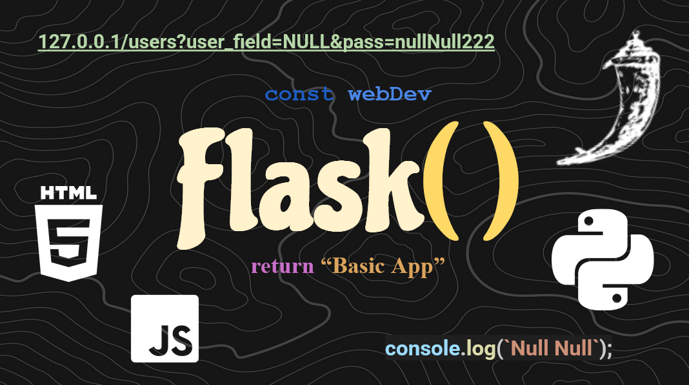

# Flask Crash Course by nullFunctionDev()

Want to learn how to use Python Flask?? This series is meant for you then! My goal is to upload a
tutorial every week both on youtube and on github so that people can follow along both ways. Thanks