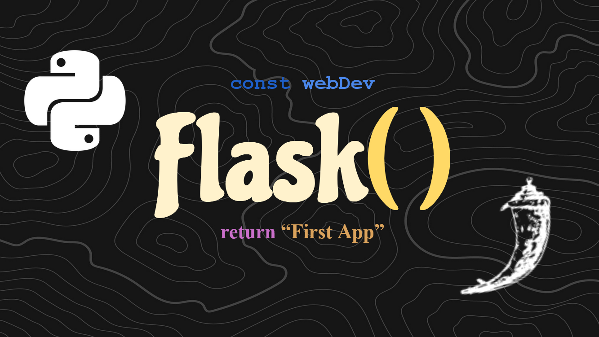

# Your First Flask Web App

In this [VIDEO](https://youtu.be/jHmWbU6RRbA) we made our first python flask web application which served up an
HTML file in our browser! This file can read values from the app.py file. 
Very simple site with not much interactibility, yet...
<br><br>


# Tips for Sucess
#### Running the App Locally:
- Activate virtual env. in correct directory/terminal
- Make sure all code is up to date and saved locally
- Run:
```sh
py app.py
```
- See it here: [WEBSITE](http://127.0.0.1:5000)


#### Creating the Virtual Environment:
```sh
py -m venv myenv
```

#### Start Env:
- Windows:
    ```sh
    myenv\Scripts\activate
    ```
- Linux:
    ```sh
    source myenv/bin/activate
    ```


#### Downloading Flask
NOTE: Make sure the virtual environment is active before doing this or it
will install eveything locally instead.
```sh
py -m pip install flask
```


#### Selecting Interpreter
NOTE: In VSCode, you have to specify your python environment so that it can see your
dependencies like Flask, MatPlotLib, and etc.
```sh
Crtl + Shift + p
'Python: Select Interpreter'
'Python x.x.x (envName) ...'
```


#### Stop Env:
- Windows:
    ```sh
    myenv\Scripts\deactivate.bat
    ```
- Linux:
    ```sh
    deactivate
    ```