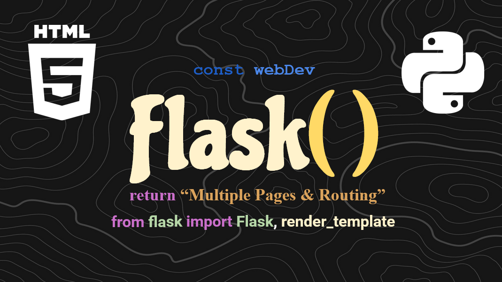

# How to Add Multiple Pages in Flask - Flask Tutorial #2
  
In this [VIDEO]() we learned how to link multiple pages into our Flask app and then
how to route between them! Thanks for watching and comment on the video for clarifiers or help.
<br><br>

# Quick Tips for Sucess
The first course discussed how to get the basic app running, a bit about what Flask is, and etc.
If you're on this video and lost, please go back and watch the first one [HERE](https://www.youtube.com/watch?v=jHmWbU6RRbA). 
Also, here are some of those common commands from course 1:

Make the virtual environment:
```sh
py -m venv myenv
```

Start the environment:
```sh
myenv\bin\activate
```

Install Flask (dependencies):
```sh
py -m pip install flask
```

Change your VSCode interpreter:
```sh
Crtl + Shift + p
'Python: Select Interpreter'
'Python x.x.x (envName) ...'
```

Stop the environment:
```sh
    myenv\Scripts\deactivate.bat
```