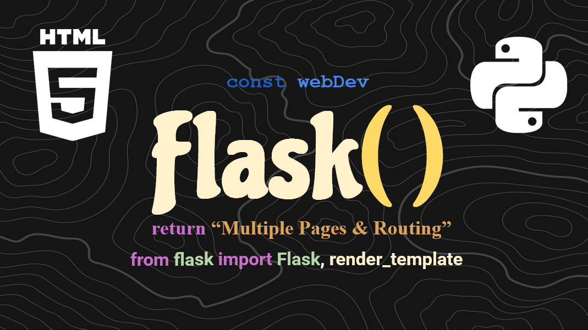

# Multiple Pages in Flask & Routing

In this [VIDEO]() we took our basic flask app and made it a little more interactable with multiple
pages and routing between them! Might be time to link in some JS and clean up the styling with a
CSS file...
<br><br>

# Quick Tips for Sucess
The first course discussed how to get the basic app running, a bit about what Flask is, and etc.
If you're on this video and lost, please go back and watch the first one [HERE](). Also, here are some of those
common commands from course 1:

Make the virtual environment:
```sh
py -m venv myenv
```

Start the environment:
```sh
myenv\Scripts\activate
```

Install Flask (dependencies):
```sh
py -m pip install flask
```

Change your VSCode interpreter:
```sh
Crtl + Shift + p
'Python: Select Interpreter'
'Python x.x.x (envName) ...'
```

Stop the environment:
```sh
    myenv\Scripts\deactivate.bat
```