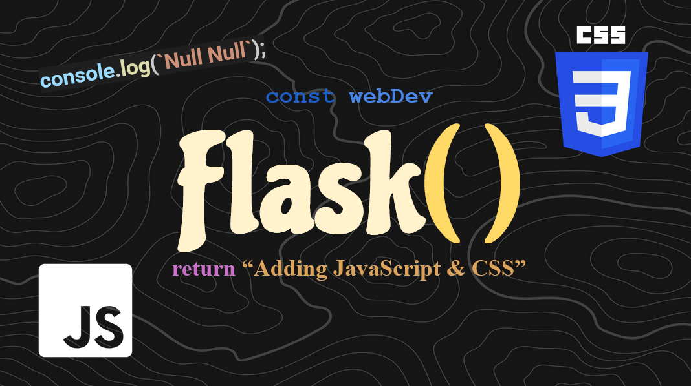

# Adding JavaScript and CSS

In this [VIDEO]() we finally added some CSS styling from a real CSS file as well as used some
JavaScript to give our pages functionality and some interactibility. Now we can really start building
our some cool projects!
<br><br>

# Quick Tips for Sucess
If you're confused on any of the topics or code we talked about, there should be two videos that
were made before this explaining everything. Please be sure to watch those videos [HERE]()
and [HERE]()

Make the virtual environment:
```sh
py -m venv myenv
```

Start the environment:
```sh
myenv\Scripts\activate
```

Install Flask (dependencies):
```sh
py -m pip install flask
```

Change your VSCode interpreter:
```sh
Crtl + Shift + p
'Python: Select Interpreter'
'Python x.x.x (envName) ...'
```

Stop the environment:
```sh
    myenv\Scripts\deactivate.bat
```