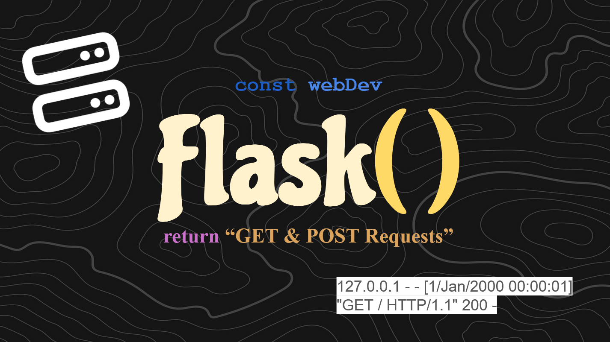

# GET & POST Endpoints

In this [VIDEO]() we discuss how to use GET and POST requests in Flask and how they
can be configured to meet different application needs. See the videos before to get a more
in-depth look into setting up Flask!
<br><br>

# Quick Tips for Sucess
If you're confused on any of the topics or code we talked about, there should be three videos that
were made before this explaining everything. Please be sure to watch those videos [HERE]()
and [HERE]()

Make the virtual environment:
```sh
py -m venv myenv
```

Start the environment:
```sh
myenv\Scripts\activate
```

Install Flask (dependencies):
```sh
py -m pip install flask
```

Change your VSCode interpreter:
```sh
Crtl + Shift + p
'Python: Select Interpreter'
'Python x.x.x (envName) ...'
```

Stop the environment:
```sh
    myenv\Scripts\deactivate.bat
```